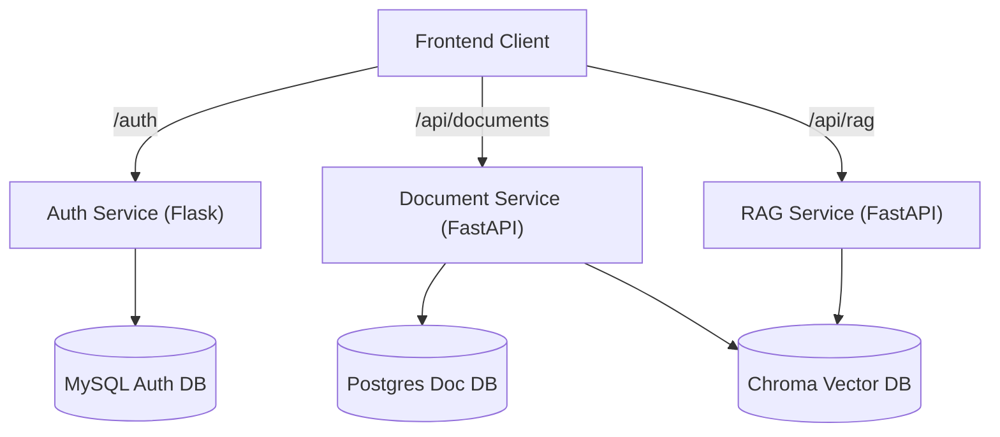

# 📚 Research Assistant

**Research Assistant** is a microservice-based web application designed to help students and researchers retrieve relevant information from uploaded documents using **Retrieval Augmented Generation (RAG)**. It seamlessly combines a modern frontend with powerful backend services to manage documents, authenticate users, and generate intelligent, AI-powered responses based on specific document contexts.


---

## 🌟 Executive Summary (For HR & Non-Technical Readers)

**What is this project?**
This application solves the problem of "information overload" by allowing researchers, students, and professionals to upload lengthy documents and ask direct questions to an AI about those documents. The AI reads the documents and formulates accurate answers based *only* on the provided text, a process known as Retrieval-Augmented Generation (RAG).

**Key Features:**
- **Secure Authentication:** Users can safely register and log in to manage their private research documents.
- **Intelligent Document Search (RAG):** Extracts and retrieves the most relevant information from uploaded documents rather than relying on generalized AI knowledge. 
- **Modern Microservices Architecture:** The app is broken down into independent, specialized services, making it scalable, resilient, and easier to maintain.

**Why this matters:**
This project demonstrates proficiency in **Full-Stack Development**, **System Design (Microservices)**, **Containerization (Docker)**, and the implementation of **Modern AI/LLM (Large Language Model) techniques**. It showcases an end-to-end understanding of how to build, connect, and deploy complex modern web architectures.

---

## 🛠️ Technical Details (For Engineers)

### 🏗️ Architecture

The application follows a distributed microservices architecture, fully containerized using Docker and Docker Compose. This ensures environment consistency across development and production deployments.



### 🚀 Tech Stack

- **Frontend**: Next.js (React), Tailwind CSS, Shadcn UI, Lucide React
- **Backend Services**: 
  - **Authentication**: Flask, SQLAlchemy (Python)
  - **Document Management**: FastAPI (Python)
  - **RAG Execution**: FastAPI (Python), Langchain/LlamaIndex
- **Databases**:
  - **MySQL**: Relational storage for user authentication data
  - **PostgreSQL**: Relational storage for document metadata
  - **ChromaDB**: Vector database for document embeddings used in semantic search
- **Infrastructure**: Docker, Docker Compose

---

## � Getting Started

Ensure you have [Docker](https://www.docker.com/get-started) and [Git](https://git-scm.com/) installed on your machine.

### 1. Clone the Repository
```bash
git clone <repository-url>
cd Research-Assistant
```

### 2. Environment Configuration
Ensure each environment `(.env)` file is appropriately configured at the root of following directories:
- `authentication/.env`
- `document_service/.env`
- `rag_service/.env`

*(Note: API keys for specific AI services like Gemini/OpenAI need to be defined in `rag_service/.env` according to the required schema.)*

### 3. Run the Services
Spin up all microservices, databases, and networks via Docker Compose:
```bash
docker-compose up --build
```

The application layers will map to the following local endpoints:
- **Frontend App**: `http://localhost:3000`
- **Auth Service Api**: `http://localhost:5000`
- **Document Service Api**: `http://localhost:6060`
- **RAG Service Api**: `http://localhost:7000`

---

## 🔌 API Reference

### Authentication Service (`:5000/auth`)
| Method | Endpoint | Description |
| :--- | :--- | :--- |
| `POST` | `/login` | Authenticate a user and issue a JWT |
| `POST` | `/register` | Register a new user |
| `POST` | `/verify` | Verify the validity of a user's JWT |
| `POST` | `/logout` | Invalidate a user's session |

### Document Service (`:6060/api/documents`)
| Method | Endpoint | Description |
| :--- | :--- | :--- |
| `POST` | `/upload` | Persist a document file and its vector embeddings |
| `GET` | `/fetch/all` | Retrieve all metadata for uploaded documents |
| `GET` | `/fetch/{file_id}`| Get metadata for a specific document |
| `DELETE` | `/delete/{file_id}`| Remove a document and its embeddings |

### RAG Service (`:7000/api/rag`)
| Method | Endpoint | Description |
| :--- | :--- | :--- |
| `POST` | `/generate` | Generate context-aware AI answers based on query and document constraints |

---

## 💻 Frontend Local Development

If you wish to develop the frontend outside the Docker network:

```bash
cd frontend
npm install
npm run dev
```

The isolated frontend will be available at `http://localhost:3000`.

---

## 🔮 Future Improvements & Roadmap

While the MVP is fully functional, there are several areas planned for enhancement:

- **AI Model Migration:** Switch or modularize the underlying AI language model (e.g., better integration with Gemini, transitioning to a different provider, switching to a more cost-effective open-source model) to reduce latency and improve answer quality.
- **Code Refactoring & Cleaning:** 
  - Standardize error handling and structured logging across all Python microservices.
  - Break down larger monolithic files into smaller modular files.
  - Implement robust unit and integration testing setups.
  - Adopt stricter type linting.
- **Advanced features:** Introduce background tasks for document processing to enhance responsiveness for large document uploads.