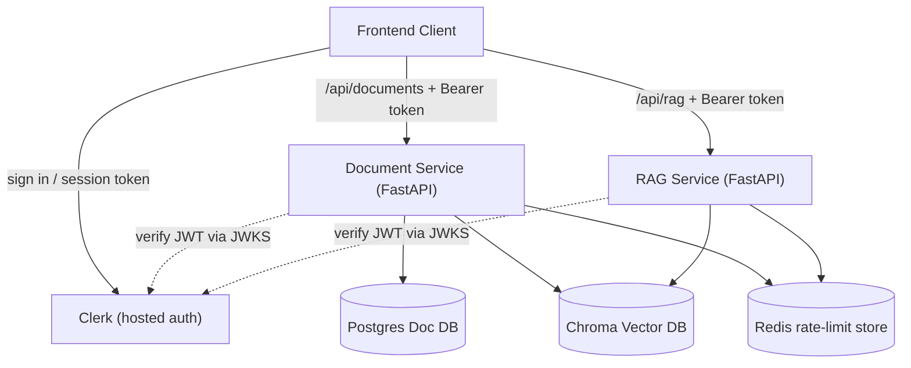

# 📚 Research Assistant

**Research Assistant** is a microservice-based web application designed to help students and researchers retrieve relevant information from uploaded documents using **Retrieval Augmented Generation (RAG)**. It combines a modern frontend with FastAPI backend services to manage documents and generate intelligent, AI-powered responses grounded in specific document contexts, with identity handled by **Clerk**.


---

## 🌟 Executive Summary (For HR & Non-Technical Readers)

**What is this project?**
This application solves the problem of "information overload" by allowing researchers, students, and professionals to upload lengthy documents and ask direct questions to an AI about those documents. The AI reads the documents and formulates accurate answers based *only* on the provided text, a process known as Retrieval-Augmented Generation (RAG).

**Key Features:**
- **Secure Authentication:** Sign-up and sign-in are handled by Clerk, a managed identity provider; each user's documents are private to their account.
- **Intelligent Document Search (RAG):** Extracts and retrieves the most relevant information from uploaded documents rather than relying on generalized AI knowledge.
- **Per-User Isolation & Rate Limiting:** Every document is owned by the user who uploaded it, and requests are rate-limited per user to protect the service and its AI budget.
- **Modern Microservices Architecture:** The app is broken down into independent, specialized services, making it scalable, resilient, and easier to maintain.

**Why this matters:**
This project demonstrates proficiency in **Full-Stack Development**, **System Design (Microservices)**, **Containerization (Docker)**, **Application Security** (managed auth, per-tenant data isolation, prompt-injection hardening, rate limiting), and the implementation of **Modern AI/LLM (Large Language Model) techniques**. It showcases an end-to-end understanding of how to build, connect, and deploy complex modern web architectures.

---

## 🛠️ Technical Details (For Engineers)

### 🏗️ Architecture

The application follows a distributed microservices architecture, fully containerized using Docker and Docker Compose. This ensures environment consistency across development and production deployments. Identity is delegated to **Clerk**: the frontend obtains a Clerk session token and presents it as `Authorization: Bearer <token>` to both backend services, which verify it against Clerk's JWKS (RS256) — the services hold no key capable of *minting* a token, only of verifying one.


```mermaid
graph TD
    Client[Frontend Client]
    Clerk["Clerk (hosted auth)"]
    Doc["Document Service (FastAPI)"]
    RAG["RAG Service (FastAPI)"]

    DocDB[(Postgres Doc DB)]
    VecDB[(Chroma Vector DB)]
    Cache[(Redis rate-limit store)]

    Client -->|sign in / session token| Clerk
    Client -->|/api/documents + Bearer token| Doc
    Client -->|/api/rag + Bearer token| RAG

    Doc -.->|verify JWT via JWKS| Clerk
    RAG -.->|verify JWT via JWKS| Clerk
    Doc --> DocDB
    Doc --> VecDB
    RAG --> VecDB
    Doc --> Cache
    RAG --> Cache
```

### 🚀 Tech Stack

- **Frontend**: Next.js (React), Tailwind CSS, Shadcn UI, Lucide React, `@clerk/nextjs`
- **Authentication**: Clerk (hosted) — RS256 session tokens verified against Clerk's JWKS on both services
- **Backend Services**:
  - **Document Management**: FastAPI (Python), SQLAlchemy, pdfplumber, python-docx
  - **RAG Execution**: FastAPI (Python), Google Gemini Flash (`gemini-3.5-flash` by default, overridable via `GEMINI_MODEL`), `sentence-transformers` (`all-MiniLM-L6-v2`) for embeddings
- **Databases & Stores**:
  - **PostgreSQL**: Relational storage for document metadata (with per-user ownership)
  - **ChromaDB**: Vector database for document embeddings used in semantic search
  - **Redis**: Shared backing store for cross-worker rate-limit counters
- **Cross-cutting**: `slowapi` for per-user and global rate limiting, structured logging, prompt-injection hardening on the RAG path
- **Infrastructure**: Docker, Docker Compose

---

## 🚦 Getting Started

Ensure you have [Docker](https://www.docker.com/get-started) and [Git](https://git-scm.com/) installed on your machine. You will also need a free **[Clerk](https://clerk.com/)** application to obtain the publishable/secret keys and JWKS URL.

### 1. Clone the Repository
```bash
git clone <repository-url>
cd Research-Assistant
```

### 2. Environment Configuration
Copy the provided `.env.example` templates and fill in your values. Each service reads its own file:

```bash
cp document_service/.env.example document_service/.env
cp rag_service/.env.example      rag_service/.env
cp frontend/.env.example         frontend/.env.local
```

- **`document_service/.env`** — `DATABASE_URL`, the `CLERK_*` verification settings, `ALLOWED_ORIGINS`, upload/rate-limit config.
- **`rag_service/.env`** — `GEMINI_API_KEY`, the same `CLERK_*` settings, `ALLOWED_ORIGINS`, generation rate limits.
- **`frontend/.env.local`** — `NEXT_PUBLIC_CLERK_PUBLISHABLE_KEY`, `CLERK_SECRET_KEY`, the Clerk sign-in/sign-up URLs, and `NEXT_PUBLIC_DOCUMENT_API_URL` / `NEXT_PUBLIC_RAG_API_URL`.

> **Note:** `frontend/.env.local` is required — `docker compose` will fail to start the frontend without it. `CLERK_ISSUER` (both services) must equal your Clerk Frontend API URL, and `CLERK_AUTHORIZED_PARTIES` must contain the frontend origin (`http://localhost:3000` locally), or every request returns 401.

### 3. Run the Services
Spin up all microservices, databases, and networks via Docker Compose:
```bash
docker-compose up --build
```

The application layers will map to the following local endpoints:
- **Frontend App**: `http://localhost:3000`
- **Document Service Api**: `http://localhost:6060`
- **RAG Service Api**: `http://localhost:7000`

---

## 🔌 API Reference

Both services require a valid Clerk session token in an `Authorization: Bearer <token>` header on every request; unauthenticated requests receive `401`. Requests are rate-limited per user (and, for generation, globally) and return `429` with a `Retry-After` header when a limit is exceeded.

### Document Service (`:6060/api/documents`)
| Method | Endpoint | Description |
| :--- | :--- | :--- |
| `POST` | `/upload` | Persist a document file and its vector embeddings (owned by the caller) |
| `GET` | `/fetch/all` | Retrieve metadata for the caller's uploaded documents |
| `GET` | `/fetch/{file_id}`| Get metadata for a specific document the caller owns |
| `DELETE` | `/delete/{file_id}`| Remove a document and its embeddings |

### RAG Service (`:7000/api/rag`)
| Method | Endpoint | Description |
| :--- | :--- | :--- |
| `POST` | `/generate` | Generate context-aware AI answers, scoped to the caller's documents |

---

## 💻 Frontend Local Development

If you wish to develop the frontend outside the Docker network:

```bash
cd frontend
npm install
npm run dev
```

The isolated frontend will be available at `http://localhost:3000`. It still needs `frontend/.env.local` (see above) and the two backend services reachable at the configured API URLs.

---

## 🔮 Future Improvements & Roadmap

While the MVP is functional, there are several areas planned for enhancement:

- **AI Model Migration:** Switch or modularize the underlying AI language model (e.g. transitioning to a different provider or a more cost-effective open-source model) to reduce latency and improve answer quality.
- **Shared Package:** Extract the duplicated `auth.py` / `logging.py` / `rate_limit.py` modules (currently copied per service, with a parity check guarding against drift) into a shared, installable package.
- **Migrations:** Replace `create_all()` with Alembic so the schema can evolve past a fresh database.
- **Performance:** Move CPU-bound embedding and PDF parsing off the async event loop, and add background tasks for large document uploads.
- **CI & Test Coverage:** Add CI (pytest + `next build` + `npm audit` + the rate-limit parity check on PR), and extend the suite with route-level cross-user authorization tests.
